# Multilingual Arabic-English SVTR OCR Recognizer

[](LICENSE.txt)
[](https://www.kaggle.com/code/ahmedkamal75/multilingual-arabic-english-svtr-ocr-recongnizer)
[](https://www.kaggle.com/code/akamalkaggle117511/multilingual-arabic-english-svtr-ocr-recongnizer)
[](https://www.kaggle.com/models/ahmedkamal75/svtr_deformable_large_epoch_58)
[](https://www.kaggle.com/datasets/ahmedkamal75/arabic-english-ocr-dataset)
[](https://www.kaggle.com/datasets/ahmedkamal75/arabic-english-ocr-synthatic-dataset-v2)
[](https://www.python.org/)

This project explores **Scene Text Recognition (STR)** using the **SVTR (Scene Visual Transformer)** architecture with **deformable attention** for multilingual OCR in **Arabic and English**.  

The work was conducted on **Kaggle GPUs (Tesla P100-PCIE-16GB)** under resource limits of **30 hours per week** and **12 hours per session**. Training was done in multiple experiments to evaluate dataset complexity, model scaling, and augmentation strategies.

---

## 📑 Contents
- [Project Overview](#-project-overview)
- [Motivation](#-motivation)
- [Datasets](#-datasets)
- [Model Architecture](#-model-architecture)
- [How to Use](#-how-to-use)
- [Experiments & Results](#-experiments--results)
  - [First Attempt](#1-first-attempt-easy-dataset)
  - [Second Attempt](#2-second-attempt-small-model--harder-dataset)
  - [Third Attempt](#3-third-attempt-large-model--scaling)
  - [Real-World Evaluation](#real-world-evaluation)
- [Key Learnings](#-key-learnings)
- [Future Work](#-future-work)
- [References](#-references)

---

## 🚀 Project Overview

This repository documents the journey of building a multilingual OCR recognizer. The key findings are:

1. **Dataset Quality is Crucial**: Simple synthetic datasets lead to models that perform well on paper but fail on real-world images. A more complex and varied synthetic dataset was created to train a more robust model.
2. **Synthetic vs. Real-World Gap**: Even with a better synthetic dataset, the final model achieves a **Character Error Rate (CER) of ~5%** on the synthetic test set but a much higher **CER of ~32%** on a manually-collected real-world test set. This highlights the significant domain gap and the limitations of purely synthetic training.
3. **Model Scaling is Effective**: A larger model (`num_blocks=[3, 12, 3]`) consistently outperformed a smaller version, demonstrating that model capacity is key to handling complex text patterns.
4. **Input Resolution Affects Performance**: Reducing input height (64 → 32) with a reasonable percentage (e.g. 50%) for horizontal languages like English and Arabic reduces computational cost without significantly reducing accuracy.

The final model, while not perfect, serves as a strong baseline and a clear case study on the challenges of multilingual OCR.

---

## 🎯 Motivation

The goal was to build a **robust OCR system** capable of recognizing both **Arabic** and **English** text, trained from scratch on synthetic datasets.  

Initial results showed that simple datasets lead to overfitting and artificially high scores, motivating the creation of **harder synthetic datasets** and **larger models**.

---

## 🏗 Model Architecture

This project is built on the **SVTR (Scene Visual Transformer)** backbone with a key enhancement:  
**Deformable Attention integrated into the local mixing stage** for better adaptability to Arabic and English text structures.

- **SVTR Overview**:  
  SVTR replaces heavy convolutional backbones with a pure transformer pipeline for scene text recognition:
  1. **Local Mixing**: Windows of the feature map are processed to extract fine-grained details (curves, strokes, diacritics).  
  2. **Global Mixing**: Dependencies across the entire sequence are captured, allowing recognition of long words and contextual features.

- **Deformable Attention**:  
  Instead of attending to all positions, the model learns **a sparse set of dynamic sampling points (`n_points=9`)**.  
  Offsets are learned per query, so the attention focuses on the most relevant regions of text, making recognition of **Arabic cursive shapes and irregular word spacing** more efficient.

- **Variants Tested**:  
  - **SMALL**: `num_blocks = [3, 6, 3]`, `embed_dims = [128, 256, 384]`, `heads = [4, 8, 12]`  
  - **LARGE**: `num_blocks = [3, 12, 3]`, `embed_dims = [128, 256, 384]`, `heads = [4, 8, 12]`  

Both versions use:  
`mlp_ratio=2`, `dropout=0.1`, `offset_scale=4.0`, `local_type` = combinations of `non_overlapping`, `deformable`.

---

## ⚙️ How to Use

Before running inference, make sure to **download the trained model checkpoint** and place it under the `models/` directory.  
👉 Best-performing model: [model.pth](https://www.kaggle.com/models/ahmedkamal75/svtr_deformable_large_epoch_58)

The main entry point for evaluation is **`inference.py`**, which loads a trained checkpoint and runs OCR on input images.

Example command:

```bash
python inference.py \
    --model_path models/model.pth \
    --image_path test_dataset_ocr/ar/ \
    --output_dir results/ar \
    --visualize \
    --analyze \
    --labels_file test_dataset_ocr/ar/ar_ground_truth.txt \
    --use_beam \
    --beam_size 20 \
    --batch_size 4 \
    --keep_aspect
```

### Arguments

* `--model_path`: Path to the trained model checkpoint (download first).
* `--image_path`: Path to a single image or a test dataset directory (e.g., `test_dataset_ocr/ar/`).
* `--output_dir`: Directory to save predictions and visualizations.
* `--visualize`: Save annotated images with recognized text overlaid.
* `--analyze`: Run dataset-style analysis (CER/WER, accuracies).
* `--labels_file`: Ground-truth labels file for evaluation.
* `--use_beam`: Enable beam search decoding.
* `--beam_size`: Beam width (default 20).
* `--batch_size`: Number of images per batch (default 4).
* `--keep_aspect`: Keep aspect ratio during resizing.


---

## 📂 Datasets

| Dataset                                                                                                                         | Source         | Samples Used      | Notes                               |
| ------------------------------------------------------------------------------------------------------------------------------- | -------------- | ----------------- | ----------------------------------- |
| [Arabic-English OCR Dataset](https://www.kaggle.com/datasets/ahmedkamal75/arabic-english-ocr-dataset)                           | TRDG synthetic | 80,000            | Easy, clean — model overfits easily |
| [Arabic-English OCR Synthetic Dataset V2](https://www.kaggle.com/datasets/ahmedkamal75/arabic-english-ocr-synthatic-dataset-v2) | TRDG synthetic | 100,000 – 120,000 | Noisy, varied, more challenging     |

---

## 🔬 Experiments & Results

### 1. First Attempt: Easy Dataset

* **Date**: Sep 4, 2025
* **Runtime**: 10h 49m
* **Dataset**: [Arabic-English OCR Dataset](https://www.kaggle.com/datasets/ahmedkamal75/arabic-english-ocr-dataset) (80k samples)
* **Config**: Input (64×512×3), Large model, 20 epochs

| Metric             | Validation | Test       |
| ------------------ | ---------- | ---------- |
| Sequence Accuracy  | 0.8287     | 0.8275     |
| Character Accuracy | 0.9187     | 0.9214     |
| Word Accuracy      | 0.9422     | 0.9424     |
| CER                | **0.0193** | **0.0185** |
| WER                | 0.0663     | 0.0667     |

> ⚠️ **Observation**: Excellent results, but dataset was too easy → not realistic, high overfitting.

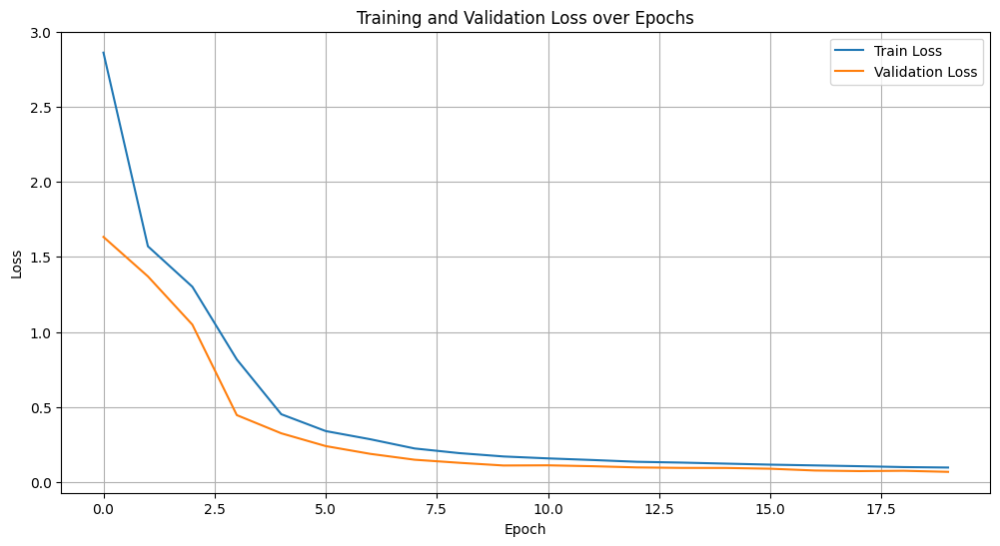
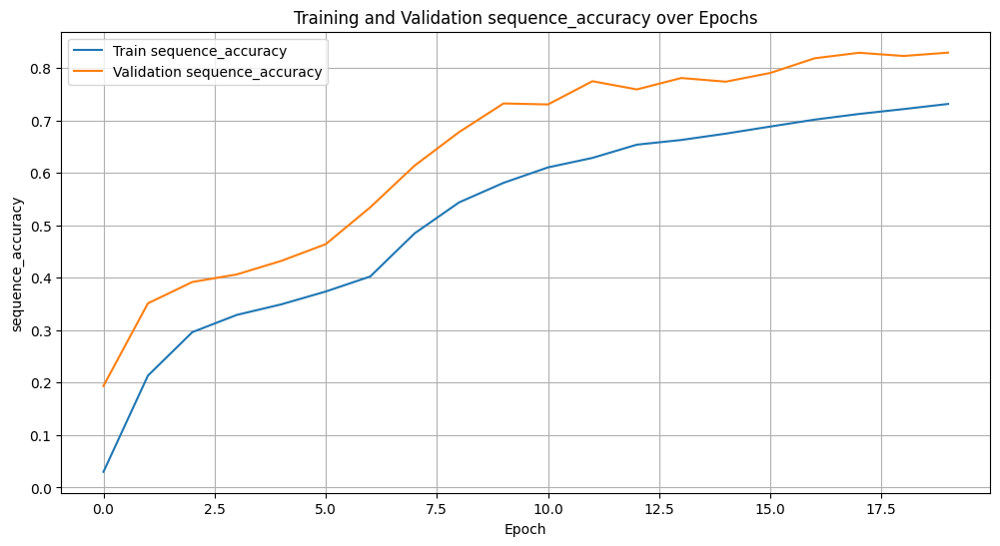
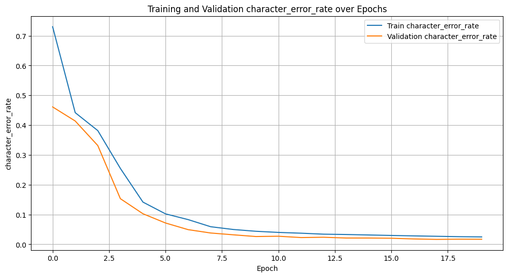
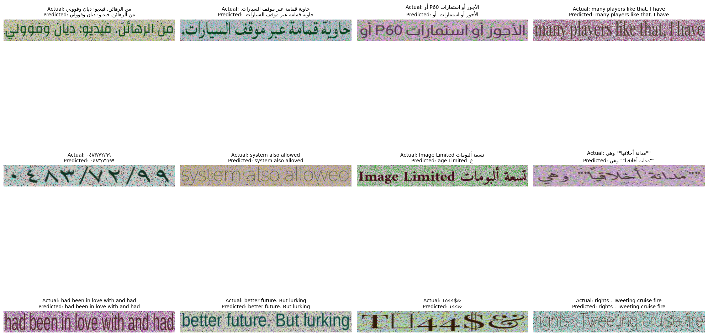
---

### 2. Second Attempt: Small Model + Harder Dataset

* **Date**: Sep 10, 2025
* **Runtime**: 19h 29m (sum of two runs)
* **Dataset**: [Synthetic Dataset V2](https://www.kaggle.com/datasets/ahmedkamal75/arabic-english-ocr-synthatic-dataset-v2) (100k samples)
* **Config**: Input (64×256×3), SMALL model, 68 with early stopping

**Best Model** → [Epoch 42](https://www.kaggle.com/models/ahmedkamal75/svtr_deformable_epoch_42_best)

| Metric             | Validation | Test       |
| ------------------ | ---------- | ---------- |
| Sequence Accuracy  | 0.6102     | 0.6194     |
| Character Accuracy |            | 0.8335     |
| Word Accuracy      |            | 0.8419     |
| CER                | **0.0696** | **0.0655** |
| WER                |            | 0.1915     |

> ✅ More realistic, but lower performance. Demonstrated the need for a **larger model** and more samples.


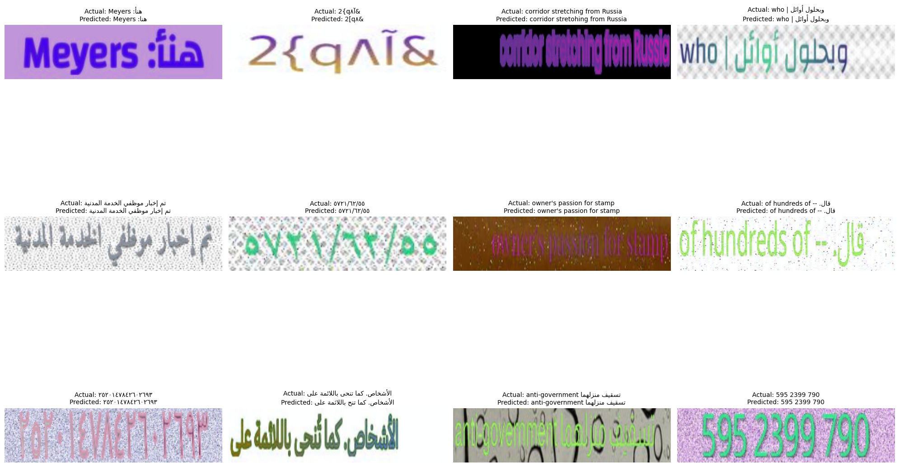


---

### 3. Third Attempt: Large Model + Scaling

* **Date**: Sep 10–12, 2025
* **Runtime**: 34h 59m (sum of 5 runs)
* **Dataset**: [Synthetic Dataset V2](https://www.kaggle.com/datasets/ahmedkamal75/arabic-english-ocr-synthatic-dataset-v2) (120k samples)
* **Config**: Input (64×256×3 → 32×256×3), LARGE model, multiple training stages

**Key Checkpoints**

* **[Epoch 46](https://www.kaggle.com/models/akamalkaggle117511/svtr_deformable_large_epoch_46)**: Input height 64
* **[Epoch 56](https://www.kaggle.com/models/ahmedkamal75/svtr_deformable_large_epoch_56)**: Input height 32
* **[Epoch 58](https://www.kaggle.com/models/ahmedkamal75/svtr_deformable_large_epoch_58)**: Input height 32 (Best Model)

| Metric             | Validation | Test       |
| ------------------ | ---------- | ---------- |
| Sequence Accuracy  | 0.6683     | 0.6637     |
| Character Accuracy |            | 0.8476     |
| Word Accuracy      |            | 0.8606     |
| CER                | **0.0574** | **0.0491** |
| WER                |            | 0.1615     |

> 🚀 **Observation**: Larger model + more samples significantly improved robustness. Achieved the lowest CER/WER across all attempts on the hard dataset.


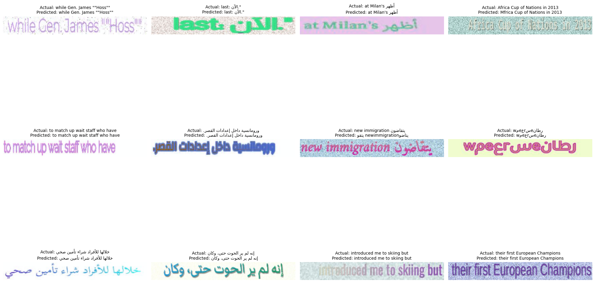


---

### Real-World Evaluation

A small real-world test set was collected manually (Arabic natural images).

* **Synthetic Test Set CER**: \~5%
* **Real-World Test Set CER**: \~32%

This demonstrates the **domain gap**: synthetic-only training does not generalize well to natural data.

---

## 🔍 Correct & Non-Correct Examples

The following images are examples of correct and non-correct OCR predictions from the model.

### Correct Examples


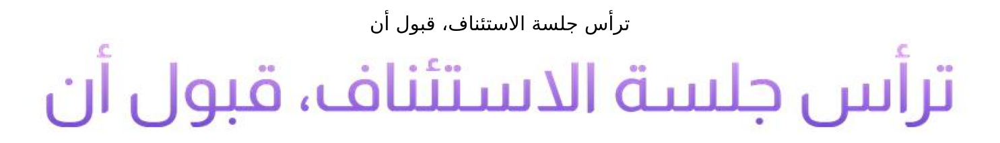
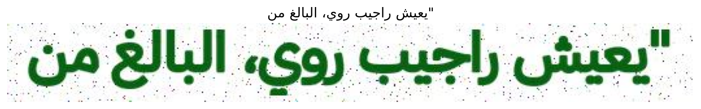
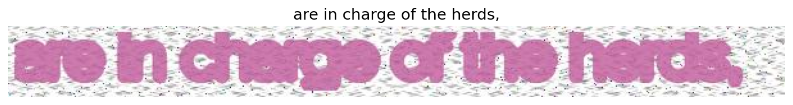
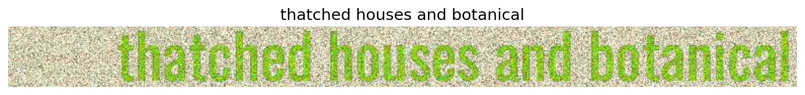
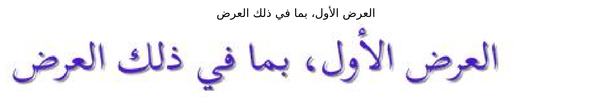

### Non-Correct Examples

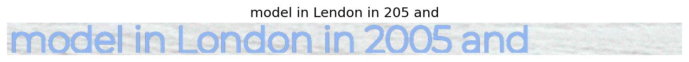


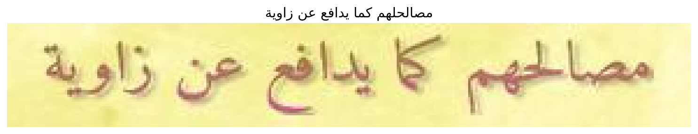
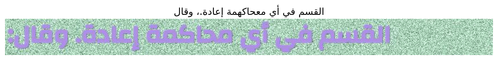
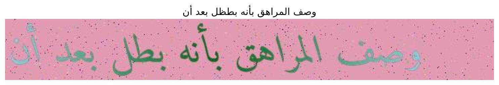

## 📌 Key Learnings

1. **Dataset matters more than model size**

   * Easy datasets → misleadingly high scores.
   * Harder datasets → more realistic but lower scores.

2. **The Synthetic-to-Real Domain Gap is Huge**

   * Models trained purely on TRDG synthetic data do not generalize to real-world images.
   * Fonts, lighting, distortions, and noise in natural images are not captured by synthetic generators.
   * A production-ready model must include **real-world samples**.

3. **Model scaling works**

   * Large model (Attempt 3) consistently outperformed Small model (Attempt 2).

4. **Aggressive augmentation helps**

   * Higher augmentation strength (0.8) improved generalization.

5. **Input resolution affects performance**

   * Reducing input height (64 → 32) halved training time while keeping accuracy competitive.

---

## 🔮 Future Work

* Collect and integrate **real-world Arabic-English text images**.
* Evaluate whether training on Arabic-only, English-only, or multilingual (Arabic+English) data yields better OCR performance.
* Train a model on both easy and hard synthetic datasets to leverage the strengths of each.
* Change input shape to (height, width) ~ (32, 512) to enable efficient computation and longer output sequence lengths for easier CTCLoss calculation.
* Explore **semi-supervised learning** with unlabeled text images.
* Benchmark against **other STR models** (e.g., SVTRv2, PARSeq, ABINet).
* Try **SVTRv2**, a more powerful and flexible STR model, on this dataset.

---

## 📚 References

* [SVTR: Scene Text Recognition with a Single Visual Model](https://arxiv.org/abs/2205.00159)
* [Kaggle Notebook (Logs)](https://www.kaggle.com/code/ahmedkamal75/multilingual-arabic-english-svtr-ocr-recongnizer)
* [Another Kaggle Notebook (logs)](https://www.kaggle.com/code/akamalkaggle117511/multilingual-arabic-english-svtr-ocr-recongnizer)
* [Dataset V1](https://www.kaggle.com/datasets/ahmedkamal75/arabic-english-ocr-dataset)
* [Dataset V2](https://www.kaggle.com/datasets/ahmedkamal75/arabic-english-ocr-synthatic-dataset-v2)
* [Best Large Model (Epoch 58)](https://www.kaggle.com/models/ahmedkamal75/svtr_deformable_large_epoch_58)

---

## ✨ **Final Note**:
This project demonstrated how **dataset complexity**, **augmentation strength**, and **model scaling** interact in multilingual OCR. The final Large model reached a **CER of \~0.05 and WER of \~0.16** on a challenging synthetic dataset — but also revealed a **32% CER on real-world text**, highlighting the urgent need for real-world training data in multilingual OCR.

## Licensing

This project is licensed under the MIT License. See the file [LICENSE](LICENSE.txt) for details.
